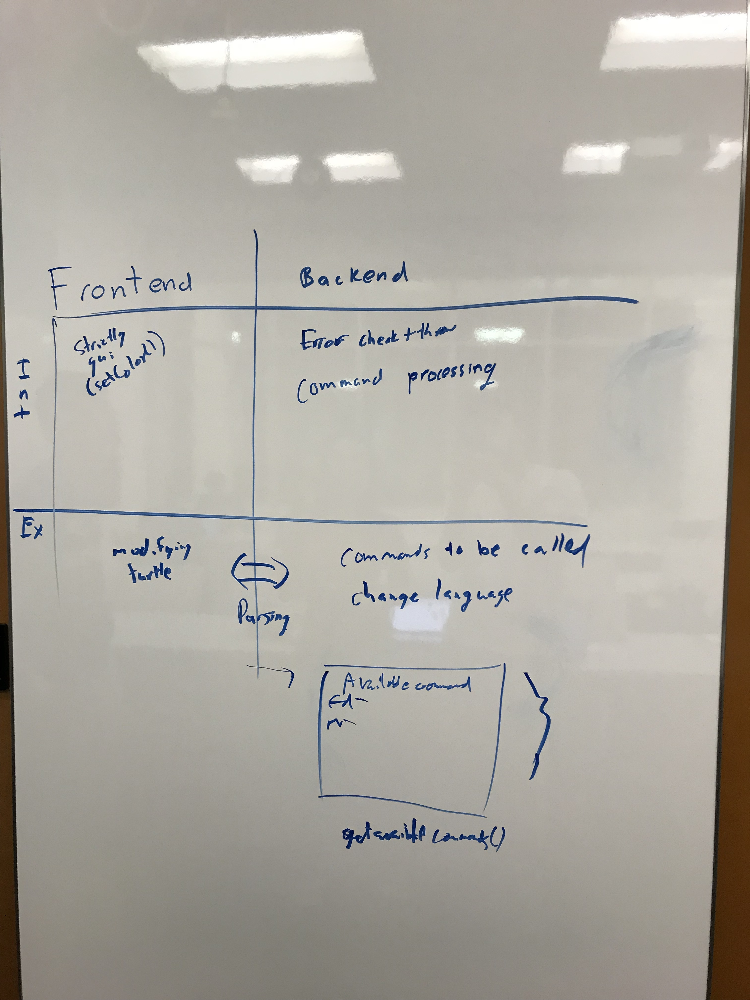

1. When does parsing need to take place and what does it need to start properly?

At the run button being pressed

2. What is the result of parsing and who receives it?

All the commands and their execution order, backend

3. When are errors detected and how are they reported?

Backend detects errors, reported through popups
The parser would check for general errors corresponding with known parameters, such as type errors. However each command would check for its own specified errors as well. 

4. What do commands know, when do they know it, and how do they get it?

Commands get information from the front end, which forwards parsed command and parameters. Each command its own parameters, and relevant information (such as current location) and executes accordingly. This process begins after front end parses.

5. How is the GUI updated after a command has completed execution?

The GUI contains private instance variables such as current location. The command will update parameters for the gui, which the gui will display

The following is an example of the implementation stucture, with the 4 relevant APIs.

